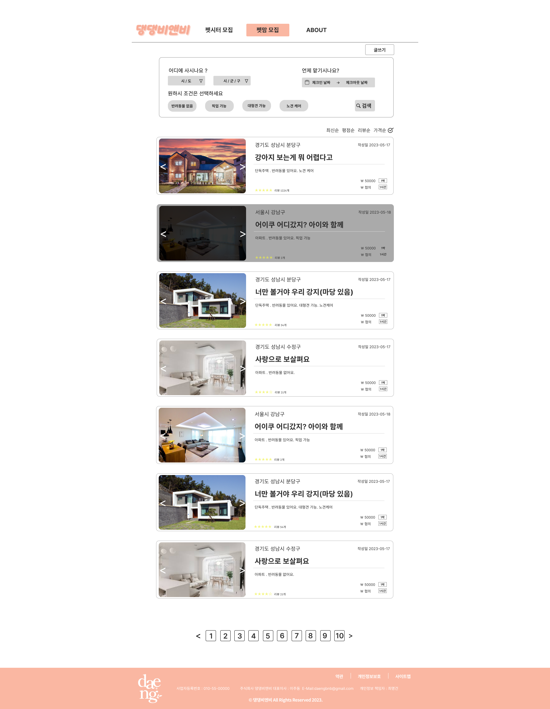

**리액트와 JSP와 AI 연동 프로젝트입니다.**

## 프로젝트 개요

You Film Face는 사용자의 사진이미지로 감정분석을 통한 컨텐츠 추천을 해주는 프로젝트입니다.

## 기술 스택

- **리액트 (Front-end 개발)**: 사용자 인터페이스를 구현하기 위해 리액트를 활용했습니다.
- **JSP (Back-end 개발)**: 백엔드 로직을 구현하고 데이터베이스와의 효율적인 통신을 위해 JSP를 사용했습니다.
- **MySQL (DataBase 구축)**: 원활한 데이터 통신을 위해 MySQL로 데이터베이스를 구축했습니다.
- **AWS, DOCKER (베포)**: 저희가 만든 프로젝트를 베포를 해보기 위해 AWS와 DOCKER를 이용했습니다.
- **YouTube Data API v3** : 감정분석을 통한 결과로 YoutubeAPI를 이용해 영상의 데이터를 받아왔습니다.

## 프로젝트 역할

저는 이 프로젝트에서 **front-end와 back-end에서 감정분석 결과를 받아와 감정에 따른 컨텐츠 추천, DBA**를 담당했습니다. 리액트를 사용하여 사용자 인터페이스를 구현하고, 백엔드를 이용해 데이터 통신을 설정했습니다.

DataBase 모델링은 DA#5를 이용해 쉽고 빠르게 구조를 만들었습니다.

## 제가 맡은 주요 기능

1. **감정분석 결과에 따른 유튜브,책,운동,음악 추천** : 각 회원과 비회원의 감정분석결과의 마지막 감정분석 결과를 가져와 감정에 따라 YoutubeAPi를 이용한 영상 추천을 맡았습니다.
2. **회원별 감정분석 조회** : 회원의 감정분석결과들을 마이페이지에서 조회할 수 있도록 구현했습니다.

   

3. **원하는 조건 검색**: 원하는 조건으로 게시판의 내용들을 찾아 볼 수 있습니다.
4. **메시지 교환 기능**: 소유자와 돌보미 간의 메시지 교환을 편리하게 할 수 있습니다.
5. **신청 시스템**: 애완동물 돌봄 신청을 쉽게 처리할 수 있으며 작성자는 신청자들의 목록을 볼 수 있습니다.
6. **리뷰 작성**: 돌봄이 끝난 후 신청을 했던 사용자만 리뷰를 작성을 할 수 있습니다.

## 결과

댕댕비엔비 프로젝트를 진행을 하면서 팀원들과 연계를 해서 만들어야 하는부분에서 소통이 모자라 코드부분을 전체적으로 수정을 했던 기억이 있습니다.
협업에 있어 제일 중요한건 소통이라고 이떄 느끼게 되었던것 같습니다. 그 후에 소통을 중시하면서 열심히 만들어 전체적으로 매끄럽게 만들고 좋게 끝난 기억이
있어 재미있게 프로젝트를 했던 것 같습니다.
