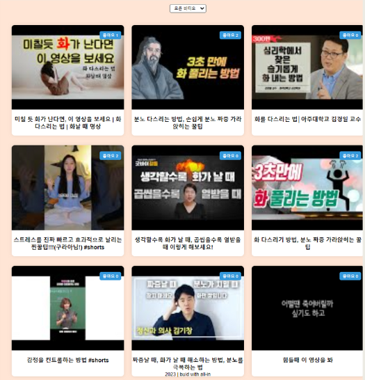
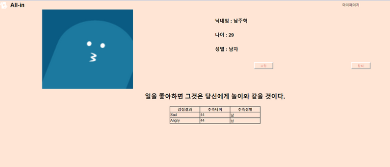

**리액트와 JSP와 AI 연동 프로젝트입니다.**

## 프로젝트 개요

You Film Face는 사용자의 사진이미지로 감정분석을 통한 컨텐츠 추천을 해주는 프로젝트입니다.

## 기술 스택

- **리액트 (Front-end 개발)**: 사용자 인터페이스를 구현하기 위해 리액트를 활용했습니다.
- **JSP (Back-end 개발)**: 백엔드 로직을 구현하고 데이터베이스와의 효율적인 통신을 위해 JSP를 사용했습니다.
- **MySQL (DataBase 구축)**: 원활한 데이터 통신을 위해 MySQL로 데이터베이스를 구축했습니다.
- **AWS, DOCKER (베포)**: 저희가 만든 프로젝트를 베포를 해보기 위해 AWS와 DOCKER를 이용했습니다.
- **YouTube Data API v3** : 감정분석을 통한 결과로 YoutubeAPI를 이용해 영상의 데이터를 받아왔습니다.

## 프로젝트 역할

저는 이 프로젝트에서 **front-end와 back-end에서 감정분석 결과를 받아와 감정에 따른 컨텐츠 추천, DBA**를 담당했습니다. 리액트를 사용하여 사용자 인터페이스를 구현하고, 백엔드를 이용해 데이터 통신을 설정했습니다.

DataBase 모델링은 DA#5를 이용해 쉽고 빠르게 구조를 만들었습니다.

## 제가 맡은 주요 기능

1. **감정분석 결과에 따른 유튜브,책,운동,음악 추천** : 각 회원과 비회원의 감정분석결과의 마지막 감정분석 결과를 가져와 감정에 따라 Youtube Data APi v3를 이용한 영상 추천을 맡았습니다.

2. **회원별 감정분석 조회** : 회원의 감정분석결과들을 마이페이지에서 조회할 수 있도록 구현했습니다.
3. **추천문구** : 사용자들이 보고 힘을 얻도록 문구들을 랜덤으로 하나 뽑아 조회할떄마다 바뀌는 기능을 구현했습니다.

## 결과

이번 You Film Face 프로젝트에서 youtube Data API v3를 사용중에 유튜브의 링크를 가져오는중에 spring Security에 막혀 링크를 온전히 가져오지 못하는 문제가 생겼습니다.
이런 문제를 해결하기 위해서 유튜브 링크를 온전히 가져오기위헤 방화벽을 해제후 가져오는 코드를 구현하면서 정상적인 데이터를 뽑아오는 일이 있었습니다.
모르는 부분이였기에 좋은 경험을 했던 프로젝트라 기억에 많이 남았던 것 같습니다.
