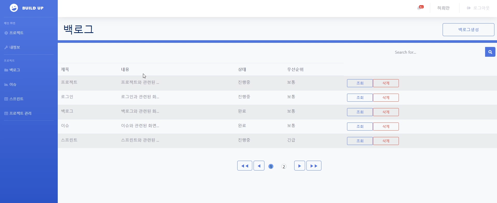

**리액트와 MyBatis를 이용한 프로젝트입니다.**

## 프로젝트 개요

Build-Up은 회사내에서 사용가능한 에자일방식의 협업툴 프로젝트입니다.
자신의 번호로 속해있는 프로젝트에 참가해 고객들과 소통을해 문제점들을 백로그에
저장을 하며 문제점들을 사원들과 이슈를 잡고 스프린트를 통해 기간내에 해결한다는 주제로 만들게 되었습니다.

## 기술 스택

- **리액트 (Front-end 개발)**: 사용자 인터페이스를 구현하기 위해 리액트를 활용했습니다.
- **MyBatis** : 프로젝트 코드와 SQL에 쿼리문을 분리해서 해보기 위해 MyBatis를 이용한 프로젝트를 진행하였습니다.
- **ORACLE (DataBase 구축)**: 원활한 데이터 통신을 위해 oracle로 데이터베이스를 구축했습니다.
- **AWS, DOCKER (베포)**: 저희가 만든 프로젝트를 베포를 해보기 위해 AWS와 DOCKER를 이용했습니다.

## 프로젝트 역할

저는 이 프로젝트에서 **front-end와 back-end에서 백로그와 DBA** 를 담당했습니다. 리액트를 이용해 자신이 속해있는 프로젝트에서 권한여부를 비교하며 백엔드 통신을 연결했습니다.

DataBase 모델링은 DA#5를 이용해 쉽고 빠르게 구조를 만들었습니다.

## 제가 맡은 주요 기능

1. **REST API**: 백로그에 데이터들을 조회, 작성, 수정, 삭제를 맡았고 권한 유뮤를 비교해
   백로그 생성 수정 삭제를 가능하도록 구현 권한은 없지만 프로젝트에 참여해 있는 인원은 조회가 가능하도록 구현을 했습니다.
2. **페이징 처리**: 한페이지에 5개의 백로그들만 보이게 구현을 했고 그 이후에 생성되는 백로그들은 페이징처리를 이용해 페이지를 자동으로 늘려가며 보이도록 구현을 했습니다.
   페이지도 10개의 페이지 이상으로 증가하면 버튼을 통해 이동하도록 구현했습니다.
3. **검색**: 빠른 검색을 할 수 있도록 제목, 내용, 백로그 상태, 우선순위를 모두 검색조건에 넣어 자신이 원하는 키워드를 검색을 해서 빠르게 볼 수 있도록 구현했습니다. 검색도 페이징을 같이 적용시켰습니다.

## 결과

처음에 백로그 부분을 맡았을떄에 저는 첫프로젝트를 진행하면서 팀원들과 연결해야는 부분들이
많아 생각보다 코드가 많이 바뀌게 되었던 것 같습니다. 무작정 코드만 짜기보다 팀원들과 구조를
더 자세히 짜보고 더 의논을 많이 했더라면 더 좋은 기능과 화면이 나왔을거 같다고 생각이들어 아쉬움이 컸습니다. 다행인건 일찍 느껴 서로의 코드들을 이해하면서 구현을 하면서 구조에 대해서 한번 더 생각해보면서 만들어 수월했던 기억이 남아 난관을 극복했다고 생각을해 뿌듯함도 들었습니다. 시간내에 목표치를 만들었다는 것에 큰 의미를 둔 프로젝트였던 것 같습니다.
